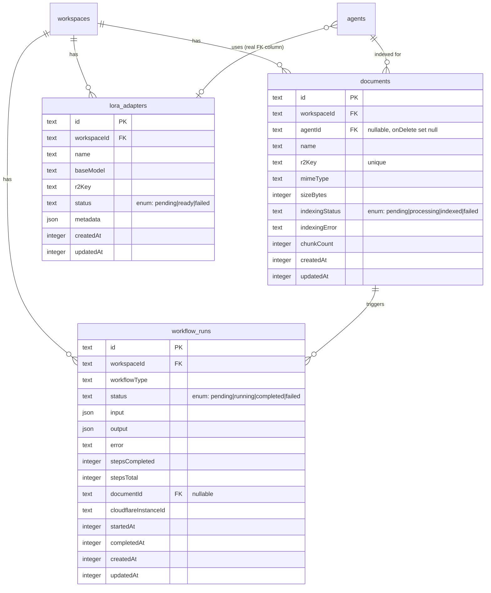

# Cloudflare-Native AI Platform

## Enhancement Summary

**Deepened on:** 2026-04-04
**Research agents used:** TypeScript reviewer, Security sentinel, Architecture strategist, Performance oracle, Agent-native reviewer, Code simplicity reviewer, Data integrity guardian, Pattern recognition specialist, Agent-native architecture skill, Framework docs researcher, Best practices researcher, Context7 documentation
**Sections enhanced:** All phases, architecture, schema, code examples

### Key Improvements
1. **All code examples corrected** — Fixed missing `outputSchema`, wrong `toMarkdown` return field, wrong wrangler config structure, non-serializable Workflow steps, binding guards, try/catch patterns
2. **Phase restructured** — Moved `convert_document` to Phase 2 (Workflows need it), rebalanced scope based on simplicity review
3. **Agent-native parity gaps filled** — Added CRUD tools for documents/workflows, gateway analytics tool, dynamic system prompt injection, capability-gated tool loading
4. **Performance optimizations** — Browser session reuse, batched embeddings, R2 presigned URLs, reranking timeout, message history capping
5. **Data integrity hardened** — Added indexes, cascade deletes, `$defaultFn`, `updatedAt`, enum status types, unique constraints

### Critical Corrections from Documentation
- **Browser Rendering** binding requires `"remote": true` (CF docs)
- **Observability** must use `traces: { enabled: true, head_sampling_rate: 0.01 }` nested structure
- **`toMarkdown()`** returns `.data` field, not `.markdown`
- **LoRA inference** uses `lora: "finetune-id"` parameter on `env.AI.run()`
- **AI Gateway** passes through 3rd arg of `env.AI.run()`, not guaranteed through `workers-ai-provider`
- **Workflow step returns** must be JSON-serializable (`ArrayBuffer` is not)

---

## Overview

Make Hare a fully Cloudflare-native AI platform by integrating every major Cloudflare AI feature. Hare already uses Workers AI, Vectorize, Agents SDK, D1, KV, and R2 — but several high-value features are missing: AI Gateway, Browser Rendering, Workflows, AI Search (AutoRAG), Voice/Vision, Reranking, enhanced MCP, and observability. This plan covers the complete integration in 5 phases, ordered by dependency and risk.

## Problem Statement

Hare is an AI agent platform deployed on Cloudflare's edge, but it only uses ~60% of the available Cloudflare AI stack. Key gaps:

1. **No cost control or caching** — Every AI inference call goes directly to Workers AI with no caching, rate limiting, analytics, or model fallbacks (AI Gateway missing)
2. **No web browsing** — Agents cannot scrape pages, take screenshots, or extract web content (Browser Rendering missing)
3. **No durable pipelines** — Document ingestion, batch processing, and multi-step AI workflows have no orchestration layer (Workflows missing)
4. **No managed RAG** — Only custom Vectorize memory; no managed document indexing pipeline (AI Search / AutoRAG missing)
5. **No voice or vision** — Agents are text-only; no speech-to-text, text-to-speech, image understanding, or document conversion
6. **No retrieval quality optimization** — RAG results are not reranked for relevance
7. **MCP incomplete** — HTTP MCP routes only expose `agentControlTools` (3 tools), not the full 59 system tools; no OAuth
8. **Stale model catalog** — Missing Llama 4 Scout, Qwen 2.5 Coder, DeepSeek R1, GLM 4.7, BGE-M3 embeddings, reranker
9. **No observability** — Tracing disabled, no structured AI logging, no analytics dashboard
10. **No model customization** — No LoRA fine-tuning support for per-agent personality

### Critical Foundational Bugs Found During Research

These must be fixed before new features:

- **`streamText` does not pass `tools`** — `packages/agent/src/hare-agent.ts` calls `streamText()` without the `tools` parameter. Agents cannot autonomously invoke tools during conversation. This blocks Features 2, 4, 5, 6, and 7.
- **Vercel AI SDK tool format mismatch** — Hare's `Tool<TInput, TOutput>` from `createTool` is NOT the same format as Vercel AI SDK's `tool()` definitions. A conversion layer is needed to map Hare tools to the AI SDK format (Zod schema + execute function). Without this, passing `agentTools` to `streamText` will not compile.
- **Memory isolation bug** — `packages/tools/src/memory.ts:139` sets `agentId` to `context.workspaceId` instead of the actual agent ID. All agents in a workspace share memory.
- **`ToolContext` missing `agentId`** — `packages/tools/src/types.ts` defines `ToolContext` with `workspaceId` and `userId` only. `agentId` is not on the type, so the memory fix won't compile without adding it.
- **MCP HTTP gap** — `packages/api/src/routes/mcp.ts:333-413` only registers `agentControlTools`. System tools (KV, R2, search, AI, etc.) are not exposed to HTTP MCP clients.
- **Workers AI tool support** — `packages/config/src/models.ts` shows `supportsTools: false` for Llama 3.3 70B. Need to verify which models support function calling and update the catalog.
- **Vectorize pagination ceiling** — `packages/api/src/services/vector-memory.ts` caps at 1000 vectors for `listMemories` and `deleteAgentMemories`. Document ingestion will create hundreds of vectors per document, exceeding this cap silently.

### Research Insights: Simplicity Assessment

> "Fully Cloudflare-native does not mean uses every Cloudflare service. It means the services Hare does use are properly integrated." — Simplicity Reviewer

**Scope recommendation:** The plan is ambitious. For maximum impact with minimum risk, **Phase 0-2 are essential** (foundation fixes, infrastructure, retrieval). **Phases 3-5 are valuable but should be treated as separate follow-up efforts** if time-constrained. The core value — fixing tool calling, adding AI Gateway, enabling observability, updating models, adding reranking, fixing MCP — delivers "fully Cloudflare-native" without the complexity of Workflows, Voice, and LoRA.

## Proposed Solution

A 5-phase rollout that progresses from low-risk infrastructure changes to high-complexity new capabilities:

```
Phase 0: Foundation Fixes (tool calling, memory bug, bindings, Vectorize ceiling)
   ↓
Phase 1: Infrastructure (AI Gateway, Observability, Model Catalog)
   ↓
Phase 2: Retrieval (Reranking, AI Search, MCP Enhancement, Document Processing)
   ↓
Phase 3: New Capabilities (Browser Rendering, Workflows)
   ↓
Phase 4: Multimodal (Voice, Vision)
   ↓
Phase 5: Customization (LoRA Fine-tuning)
```

### Research Insights: Phase Dependency Correction

The architecture review found that `convert_document` (`toMarkdown()`) was in Phase 4 but is a prerequisite for Phase 3's `DocumentIngestionWorkflow`. It has been moved to Phase 2.

## Technical Approach

### Architecture

All new features follow the existing Hare architecture:

- **Bindings** declared in `apps/web/wrangler.jsonc`
- **Types** added to BOTH `packages/tools/src/env.ts` (`HareEnv`) AND `packages/types/src/cloudflare.ts` (`CloudflareEnv`)
- **Tools** implemented in `packages/tools/src/` using `createTool` pattern with `outputSchema`
- **Routes** added to `packages/api/src/orpc/routers/` using `requireWrite`/`requireAdmin` guards
- **Config** extended in `packages/config/src/` with canonical Zod schema
- **Schema** changes in `packages/db/src/schema/` with indexes, cascades, and `$defaultFn`
- **UI** pages in `packages/app/pages/`
- **Workflows** in `apps/web/src/workflows/` (must export from Worker entry point) with business logic extracted to `packages/tools/src/`

### Research Insights: Architecture Principles

1. **Capability-gated tool loading** — `getSystemTools()` should accept an optional capabilities filter. If `browserEnabled` is false, skip `getBrowserTools()`. This keeps tool sets lean per agent, improving model tool-selection accuracy.
2. **Single canonical config schema** — Define one `AgentConfigSchema` (Zod) in `packages/config/` shared by both oRPC routes and Durable Object validation.
3. **API layer ownership** — Hono = protocol adapters (WebSocket, MCP, OAuth, SSE). oRPC = all business logic. Durable Object = stateful agent runtime only.
4. **Workflow business logic extraction** — Keep `WorkflowEntrypoint` classes in `apps/web/src/workflows/` (required for Worker export). Extract reusable logic (chunking, embedding batching) to `packages/tools/src/` or `packages/pipelines/`.

### New Wrangler Bindings Required

```jsonc
// apps/web/wrangler.jsonc additions — add each in the phase that uses it

// Browser Rendering (Phase 3) — NOTE: "remote: true" is required
"browser": {
  "binding": "BROWSER",
  "remote": true
},

// Workflows (Phase 3)
"workflows": [
  {
    "name": "document-ingestion",
    "binding": "DOCUMENT_INGESTION_WORKFLOW",
    "class_name": "DocumentIngestionWorkflow"
  }
],

// Observability — enable tracing (Phase 1)
// CORRECTED: must use nested "traces" object per CF docs
"observability": {
  "enabled": true,
  "logs": {
    "enabled": true,
    "head_sampling_rate": 0.1
  },
  "traces": {
    "enabled": true,
    "head_sampling_rate": 0.01
  }
}
```

AI Gateway does not require a wrangler binding — it's configured via the gateway ID parameter on `env.AI.run()` calls. Add `AI_GATEWAY_ID` to `[vars]`.

### New Database Schema

```ts
// packages/db/src/schema/documents.ts (Phase 2)
// CORRECTED: Added $defaultFn, indexes, cascades, updatedAt, enums, unique constraint
import { createId } from '../id'

export const DOCUMENT_INDEXING_STATUSES = ['pending', 'processing', 'indexed', 'failed'] as const

export const documents = sqliteTable('documents', {
  id: text('id').primaryKey().$defaultFn(() => createId()),
  workspaceId: text('workspaceId').notNull().references(() => workspaces.id, { onDelete: 'cascade' }),
  agentId: text('agentId').references(() => agents.id, { onDelete: 'set null' }),
  name: text('name').notNull(),
  r2Key: text('r2Key').notNull(),
  mimeType: text('mimeType').notNull(),
  sizeBytes: integer('sizeBytes').notNull(),
  indexingStatus: text('indexingStatus', { enum: DOCUMENT_INDEXING_STATUSES }).notNull().default('pending'),
  indexingError: text('indexingError'),
  chunkCount: integer('chunkCount'),
  createdAt: integer('createdAt', { mode: 'timestamp' }).notNull().$defaultFn(() => new Date()),
  updatedAt: integer('updatedAt', { mode: 'timestamp' }).notNull().$defaultFn(() => new Date()),
}, (table) => ({
  documentsWorkspaceIdx: index('documents_workspace_idx').on(table.workspaceId),
  documentsAgentIdx: index('documents_agent_idx').on(table.agentId),
  documentsWorkspaceStatusIdx: index('documents_workspace_status_idx').on(table.workspaceId, table.indexingStatus),
  documentsR2KeyIdx: uniqueIndex('documents_r2key_idx').on(table.r2Key),
}))

// packages/db/src/schema/workflow-runs.ts (Phase 3)
export const WORKFLOW_STATUSES = ['pending', 'running', 'completed', 'failed'] as const

export const workflowRuns = sqliteTable('workflow_runs', {
  id: text('id').primaryKey().$defaultFn(() => createId()),
  workspaceId: text('workspaceId').notNull().references(() => workspaces.id, { onDelete: 'cascade' }),
  workflowType: text('workflowType').notNull(),
  status: text('status', { enum: WORKFLOW_STATUSES }).notNull().default('pending'),
  input: text('input', { mode: 'json' }).$type<Record<string, unknown>>(),
  output: text('output', { mode: 'json' }).$type<Record<string, unknown>>(),
  error: text('error'),
  stepsCompleted: integer('stepsCompleted').default(0),
  stepsTotal: integer('stepsTotal'),
  documentId: text('documentId').references(() => documents.id, { onDelete: 'set null' }),
  cloudflareInstanceId: text('cloudflareInstanceId'),
  startedAt: integer('startedAt', { mode: 'timestamp' }),
  completedAt: integer('completedAt', { mode: 'timestamp' }),
  createdAt: integer('createdAt', { mode: 'timestamp' }).notNull().$defaultFn(() => new Date()),
  updatedAt: integer('updatedAt', { mode: 'timestamp' }).notNull().$defaultFn(() => new Date()),
}, (table) => ({
  workflowRunsWorkspaceIdx: index('workflow_runs_workspace_idx').on(table.workspaceId),
  workflowRunsStatusIdx: index('workflow_runs_workspace_status_idx').on(table.workspaceId, table.status),
  workflowRunsTypeIdx: index('workflow_runs_workspace_type_idx').on(table.workspaceId, table.workflowType),
  workflowRunsCfInstanceIdx: index('workflow_runs_cf_instance_idx').on(table.cloudflareInstanceId),
}))

// packages/db/src/schema/lora-adapters.ts (Phase 5)
export const LORA_ADAPTER_STATUSES = ['pending', 'ready', 'failed'] as const

export const loraAdapters = sqliteTable('lora_adapters', {
  id: text('id').primaryKey().$defaultFn(() => createId()),
  workspaceId: text('workspaceId').notNull().references(() => workspaces.id, { onDelete: 'cascade' }),
  name: text('name').notNull(),
  baseModel: text('baseModel').notNull(),
  r2Key: text('r2Key').notNull(),
  status: text('status', { enum: LORA_ADAPTER_STATUSES }).notNull().default('pending'),
  metadata: text('metadata', { mode: 'json' }).$type<{ rank?: number; epochs?: number; loss?: number }>(),
  createdAt: integer('createdAt', { mode: 'timestamp' }).notNull().$defaultFn(() => new Date()),
  updatedAt: integer('updatedAt', { mode: 'timestamp' }).notNull().$defaultFn(() => new Date()),
}, (table) => ({
  loraAdaptersWorkspaceIdx: index('lora_adapters_workspace_idx').on(table.workspaceId),
  loraAdaptersStatusIdx: index('lora_adapters_workspace_status_idx').on(table.workspaceId, table.status),
}))
```

### Agent Config Schema Extension

```ts
// packages/config/src/ — extend agent config
// CORRECTED: Use nested capabilities pattern, single canonical Zod schema

import { z } from 'zod'

export const AgentCapabilitiesSchema = z.object({
  aiGateway: z.object({
    enabled: z.boolean(),
    cacheTtl: z.number().optional(),
  }).optional(),
  voice: z.object({
    enabled: z.boolean(),
    ttsModel: z.string().optional(),
    sttModel: z.string().optional(),
    voicePreset: z.string().optional(),
  }).optional(),
  vision: z.object({
    enabled: z.boolean(),
    model: z.string().optional(),
  }).optional(),
  reranking: z.object({
    enabled: z.boolean(),
    model: z.string().optional(),
    threshold: z.number().min(0).max(1).optional(),
  }).optional(),
  browser: z.object({
    enabled: z.boolean(),
  }).optional(),
  rag: z.object({
    backend: z.enum(['vectorize', 'autorag']),
    autoragInstance: z.string().optional(),
  }).optional(),
}).optional()

export const AgentConfigSchema = z.object({
  // Core inference params
  temperature: z.number().optional(),
  maxTokens: z.number().optional(),
  topP: z.number().optional(),
  topK: z.number().optional(),
  stopSequences: z.array(z.string()).optional(),
  // Feature capabilities
  capabilities: AgentCapabilitiesSchema,
})

export type AgentConfig = z.infer<typeof AgentConfigSchema>
```

### Research Insights: Config Design

- `loraAdapterId` should be a **real column** on the `agents` table with a FK to `lora_adapters.id` and `onDelete: 'set null'` — JSON config cannot enforce referential integrity
- `ragBackend` could also be a real column since it determines query routing logic
- Keep nested capability objects in JSON config for now — they are only read at inference time

### ERD for New Models



### Implementation Phases

---

#### Phase 0: Foundation Fixes

Fix the critical bugs that block all subsequent phases. **This must ship before anything else.**

##### 0.1 Wire Tool Calling into `streamText`

**File:** `packages/agent/src/hare-agent.ts`

The `handleChat` method calls `streamText()` without passing tools. Additionally, Hare's `Tool<TInput, TOutput>` format is NOT the same as Vercel AI SDK's tool format — a conversion layer is needed.

### Research Insights: Tool Format Mismatch

Vercel AI SDK `streamText` expects tools in its own format:
```ts
import { tool } from 'ai'
const myTool = tool({
  description: 'Tool description',
  parameters: z.object({ query: z.string() }), // Zod schema
  execute: async ({ query }) => { /* ... */ },
})
```

Hare tools use `createTool` with `inputSchema`/`outputSchema`/`execute(params, context)`. A converter is needed:

```ts
// packages/agent/src/tool-adapter.ts — convert Hare tools to AI SDK format
import { tool as aiTool } from 'ai'
import type { AnyTool, ToolContext } from '@hare/tools'

export function toAISDKTools(hareTools: AnyTool[], context: ToolContext) {
  return Object.fromEntries(
    hareTools.map(t => [
      t.id,
      aiTool({
        description: t.description,
        parameters: t.inputSchema,
        execute: async (params) => t.execute(params, context),
      }),
    ])
  )
}
```

```ts
// packages/agent/src/hare-agent.ts — handleChat method
import { stepCountIs } from 'ai'
import { toAISDKTools } from './tool-adapter'

const aiTools = toAISDKTools(agentTools, toolContext)
const result = await streamText({
  model: createWorkersAIModel({ modelName: modelId, ai: env.AI }),
  messages: messages.slice(-50), // Cap history — see Performance Insights
  tools: aiTools,
  stopWhen: stepCountIs(5),
  onStepFinish: async ({ toolCalls, toolResults }) => {
    // Log tool usage for observability
  },
})
```

- [ ] Create `packages/agent/src/tool-adapter.ts` — convert Hare tools to AI SDK format
- [ ] Wire `tools` parameter into `streamText()` call — `packages/agent/src/hare-agent.ts`
- [ ] Add `stopWhen: stepCountIs(5)` to allow iterative tool calling (AI SDK v6 syntax)
- [ ] Cap message history sent to LLM (last 50 messages or ~32K tokens) — keep full history in D1
- [ ] Verify which Workers AI models support tool calling via `workers-ai-provider`
- [ ] Update `packages/config/src/models.ts` — set `supportsTools: true` for models that support it
- [ ] Add integration test for tool calling round-trip
- [ ] Implement capability-gated tool loading: `getSystemTools(context, capabilities)` — only load tools matching agent's enabled capabilities

### Research Insights: Performance — Message History

The existing `handleChat` serializes entire conversation history (up to 100 messages) on every `setState` call — ~200KB at scale. Cap the window sent to `streamText` at 50 messages. Store full history in D1, keep Durable Object state as a cache.

##### 0.2 Fix Memory Isolation Bug + Add `agentId` to ToolContext

**File:** `packages/tools/src/memory.ts:139` and `packages/tools/src/types.ts`

```ts
// packages/tools/src/types.ts — add agentId to ToolContext
export interface ToolContext {
  env: HareEnv
  workspaceId: string
  userId: string
  agentId: string // ← ADD THIS
}
```

```ts
// packages/tools/src/memory.ts:139
// Before (bug — stores workspaceId as agentId)
agentId: context.workspaceId,

// After (correct — stores actual agentId)
agentId: context.agentId,
```

### Research Insights: Vectorize Migration Strategy

After the fix, new vectors have correct `agentId`, but old vectors have `workspaceId` in the `agentId` field. Queries filtering by correct `agentId` will miss all pre-fix memories (effectively data loss).

**Recommended strategy:**
1. Fix the code immediately
2. Add fallback in `recall_memory`: query with both `agentId` AND `workspaceId` as `agentId`
3. Provide a manual re-indexing tool for users who want to migrate old vectors
4. Document as known limitation for existing deployments

- [ ] Add `agentId` to `ToolContext` type — `packages/tools/src/types.ts`
- [ ] Fix `agentId` assignment in `store_memory` tool — `packages/tools/src/memory.ts:139`
- [ ] Fix `agentId` filter in `recall_memory` tool — add fallback for legacy workspace-scoped vectors
- [ ] Add test verifying memory is scoped per-agent, not per-workspace
- [ ] Update all `ToolContext` construction sites to pass `agentId`

##### 0.3 Fix MCP HTTP Routes (Move from Phase 2 — this is a bug fix, not a feature)

**File:** `packages/api/src/routes/mcp.ts:333-413`

- [ ] Register all system tools in HTTP MCP routes — `packages/api/src/routes/mcp.ts`
- [ ] Ensure new tools added in later phases are auto-registered via `getSystemTools()`

##### 0.4 Fix Vectorize Pagination Ceiling

**File:** `packages/api/src/services/vector-memory.ts`

### Research Insights: Performance — Vectorize at Scale

`listMemories` and `deleteAgentMemories` cap at 1000 vectors. Document ingestion creates ~250 vectors per document. After 4 documents, this cap is silently hit.

**Fix:** Store parallel metadata records in D1 for listing/pagination. Use Vectorize only for semantic search. Loop deletes until zero results returned.

- [ ] Add D1 metadata table for vector records (id, agentId, workspaceId, createdAt, content snippet)
- [ ] Refactor `listMemories` to query D1 for listing, not Vectorize dummy embedding queries
- [ ] Refactor `deleteAgentMemories` to loop: query 1000 → delete → repeat until empty

##### 0.5 Update HareEnv and CloudflareEnv

- [ ] Add new binding types to `HareEnv` — `packages/tools/src/env.ts`
- [ ] Add new binding types to `CloudflareEnv` — `packages/types/src/cloudflare.ts`
- [ ] Consider `CloudflareEnv extends HareEnv` for drift prevention
- [ ] Update `compatibility_date` to `2026-03-31` — `apps/web/wrangler.jsonc`
- [ ] Enable tracing in wrangler.jsonc (correct structure) — `apps/web/wrangler.jsonc`
- [ ] Run `bun run typecheck` to verify no regressions

---

#### Phase 1: Infrastructure (AI Gateway, Observability, Model Catalog)

Low risk. No new bindings needed. Establishes cost control and monitoring before adding new features.

##### 1.1 AI Gateway Integration

**What:** Route all Workers AI inference through Cloudflare AI Gateway for caching, rate limiting, and analytics.

### Research Insights: AI Gateway + workers-ai-provider

Context7 docs confirm AI Gateway is configured via 3rd argument to `env.AI.run()`:
```ts
const response = await env.AI.run(model, input, {
  gateway: { id: "hare-gateway", skipCache: false, cacheTtl: 3360 }
})
```

The `workers-ai-provider` package may or may not forward this gateway option. **Verify before implementation.** If it doesn't, create a wrapped AI binding that injects gateway config:

```ts
// packages/agent/src/providers/workers-ai.ts
// CORRECTED: Use options object pattern per CLAUDE.md convention
export function createWorkersAIModel(options: {
  modelName: string
  ai: Ai
  gateway?: { id: string; skipCache?: boolean; cacheTtl?: number }
}) {
  return createWorkersAI({
    binding: options.ai,
    // If workers-ai-provider supports gateway option:
    gateway: options.gateway,
  })(options.modelName)
}
```

### Research Insights: Performance — Cache Hit Rates

- **Embedding calls**: 15-25% cache hit rate (same text re-embedded). Set `cacheTtl: 3600`.
- **Chat completions**: <5% cache hit rate (unique conversation context). Consider disabling cache.
- **Reranking**: ~0% (query + documents differ each time).
- **Net cost savings**: Realistically 10-15%, not 30%.

**For better savings:** Cache at the application layer — cache `ai_search` results in KV for 60-120 seconds by query hash.

- [ ] Create AI Gateway `hare-gateway` in Cloudflare dashboard
- [ ] Add `AI_GATEWAY_ID` to wrangler.jsonc `[vars]` — `apps/web/wrangler.jsonc`
- [ ] Verify `workers-ai-provider` supports gateway option; if not, create AI binding wrapper
- [ ] Update `createWorkersAIModel` to accept gateway config (options object pattern) — `packages/agent/src/providers/workers-ai.ts`
- [ ] Pass gateway config from env vars through `handleChat` — `packages/agent/src/hare-agent.ts`
- [ ] Add graceful fallback: if gateway is unreachable, fall back to direct `env.AI` binding
- [ ] Add KV-based application-layer caching for `ai_search` results (query hash → cached results, 120s TTL)

### Research Insights: Simplicity — Keep Gateway Global

Per simplicity review: Do NOT add per-agent gateway config in Phase 1. A single global gateway via env var is sufficient. Add per-agent config later if users need different caching behavior per agent.

##### 1.2 Observability: Enable Tracing

```jsonc
// apps/web/wrangler.jsonc — CORRECTED structure per CF docs
"observability": {
  "enabled": true,
  "logs": {
    "enabled": true,
    "head_sampling_rate": 0.1
  },
  "traces": {
    "enabled": true,
    "head_sampling_rate": 0.01
  }
}
```

- [ ] Enable tracing in wrangler.jsonc with correct structure — `apps/web/wrangler.jsonc`
- [ ] Add structured JSON logging for AI calls (model, tokens, latency, cache hit) — `packages/agent/src/hare-agent.ts`
- [ ] Add AI Gateway log ID capture (`env.AI.aiGatewayLogId`) after each inference — for cost attribution

##### 1.3 Model Catalog Update

**New models to add to `packages/config/src/models.ts`:**

| Model ID | Category | Notes |
|----------|----------|-------|
| `@cf/meta/llama-4-scout-17b-16e-instruct` | Text Generation | Newest MoE, fast |
| `@cf/qwen/qwen2.5-coder-32b-instruct` | Code Generation | Best for code tasks |
| `@cf/deepseek-ai/deepseek-r1-distill-qwen-32b` | Reasoning | Deep reasoning |
| `@cf/zai-org/glm-4.7-flash` | Text Generation | Fast inference |
| `@cf/google/embeddinggemma-300m` | Embeddings | 100+ languages |
| `@cf/baai/bge-m3` | Embeddings | Multi-lingual, hybrid retrieval |
| `@cf/baai/bge-reranker-base` | Reranking | New category |
| `@cf/openai/whisper-large-v3-turbo` | Speech-to-Text | Faster STT |
| `@cf/myshell-ai/melotts` | Text-to-Speech | First TTS model |
| `@cf/deepgram/aura-1` | Text-to-Speech | Deepgram Aura TTS |
| `@cf/llava-hf/llava-1.5-7b-hf` | Vision | Image understanding |

- [ ] Add all new models with proper categories and verified `supportsTools` flags
- [ ] Mark deprecated models (Qwen 1.5, Gemma 7B) as `deprecated: true`
- [ ] Add model categories: `code`, `reasoning`, `vision`, `speech-to-text`, `text-to-speech`, `reranking`
- [ ] Update model selector UI to show categories and recommended badges
- [ ] Add new `ToolCategory` values: `browser`, `voice`, `vision`, `document` — update `getToolsByCategory` switch

---

#### Phase 2: Retrieval Enhancement (Reranking, AI Search, Document Processing, MCP)

Improves retrieval quality and external integration. Moderate complexity.

##### 2.1 Reranking Integration

```ts
// packages/api/src/services/vector-memory.ts — enhance recall
import { rerank } from 'ai'
import { createWorkersAI } from 'workers-ai-provider'

async function recallWithReranking(options: {
  query: string
  candidates: VectorizeResult[]
  env: HareEnv
  threshold?: number
}) {
  const { query, candidates, env, threshold = 0.5 } = options
  const workersai = createWorkersAI({ binding: env.AI })

  // 500ms timeout with fallback to un-reranked results
  const controller = new AbortController()
  const timeout = setTimeout(() => controller.abort(), 500)

  try {
    // workers-ai-provider does NOT implement RerankingModel — use env.AI.run() directly
    const reranked = await env.AI.run('@cf/baai/bge-reranker-base', {
      query,
      documents: candidates.map(c => c.metadata.content),
    })
    return (reranked.data ?? [])
      .filter((r: { score: number }) => r.score >= threshold)
      .map((r: { index: number }) => candidates[r.index])
  } catch {
    // Timeout or error — return un-reranked results
    return candidates
  } finally {
    clearTimeout(timeout)
  }
}
```

### Research Insights: Performance — Reranking Tradeoff

Reranking adds 100-200ms latency but improves retrieval precision by 10-30%. Worth it for document Q&A and knowledge bases. Less valuable for simple conversation memory recall.

- **Fetch with larger topK (20) from Vectorize, rerank down to final topK (5)**
- **500ms timeout with fallback** to un-reranked results
- **Make opt-in per agent** (default off for backward compat, recommended on for document-heavy agents)

- [ ] Add reranking step to `recallMemory` in `packages/api/src/services/vector-memory.ts`
- [ ] Add 500ms timeout with fallback to un-reranked results
- [ ] Fetch larger candidate set (topK: 20) then rerank to final set (topK: 5)
- [ ] Add `reranking` parameter to `recall_memory` tool (agent can explicitly enable/disable)
- [ ] Return `reranked: boolean` flag in tool output for transparency
- [ ] Add `reranking` config to agent capabilities schema

##### 2.2 Document Processing with `toMarkdown()`

**Moved from Phase 4** — This is a prerequisite for the document ingestion workflow in Phase 3.

### Research Insights: toMarkdown API Correction

Context7 docs show `toMarkdown()` returns `.data` field, NOT `.markdown`:
```ts
const result = await env.AI.toMarkdown([{ name: "doc.pdf", blob }])
// result[0].data contains the markdown (NOT result[0].markdown)
// result[0].tokens contains token count
```

```ts
// packages/tools/src/document.ts — CORRECTED field name and full pattern
import { z } from 'zod'
import { createTool, success, failure, type ToolContext } from './types'

const ConvertDocumentOutputSchema = z.object({
  markdown: z.string(),
  tokens: z.number(),
})

export const convertDocumentTool = createTool({
  id: 'convert_document',
  description: 'Convert a document (PDF, image) to markdown text',
  inputSchema: z.object({
    r2Key: z.string().describe('R2 object key of the document'),
  }),
  outputSchema: ConvertDocumentOutputSchema, // ← REQUIRED by createTool
  execute: async (params, context) => {
    if (!context.env.AI) return failure('AI binding not available')
    if (!context.env.R2) return failure('R2 bucket not available')
    try {
      const obj = await context.env.R2.get(params.r2Key)
      if (!obj) return failure('Document not found in R2')
      const blob = new Blob([await obj.arrayBuffer()])
      const result = await context.env.AI.toMarkdown([{ name: params.r2Key, blob }])
      return success({ markdown: result[0].data, tokens: result[0].tokens }) // .data not .markdown
    } catch (error) {
      return failure(`Failed to convert document: ${error instanceof Error ? error.message : 'Unknown error'}`)
    }
  },
})
```

- [ ] Implement `convert_document` tool with correct `.data` field — `packages/tools/src/document.ts`
- [ ] Add `outputSchema` (required by `createTool` pattern)
- [ ] Add binding guards (`if (!context.env.AI)`) and try/catch
- [ ] Register in `getDocumentTools()` and `getSystemTools()`

##### 2.3 AI Search (AutoRAG) Integration

- [ ] Create `documents` table with all indexes, cascades, defaults — `packages/db/src/schema/documents.ts`
- [ ] Create document upload API route (R2 presigned URL for upload, D1 tracking) — `packages/api/src/orpc/routers/documents.ts`
- [ ] Create `ai_search` tool with `outputSchema` — `packages/tools/src/search.ts`
- [ ] Create document management tools for agent parity: `list_documents`, `get_document`, `delete_document`, `trigger_indexing`
- [ ] Add `ragBackend` and `autoragInstance` to agent capabilities config
- [ ] Create document management UI — `packages/app/pages/agents/AgentDocumentsPage.tsx`
- [ ] Use R2 presigned URLs for document uploads to avoid Worker memory pressure on large files
- [ ] Add document upload size limit (25MB for in-memory processing via `toMarkdown`)
- [ ] Create Drizzle migration for `documents` table

### Research Insights: Performance — R2 Upload

Workers have a 128MB memory limit. `toMarkdown()` reads entire file into memory. Cap at 25MB for in-memory processing. For larger files, use R2 presigned URLs and batch processing in Workflows.

##### 2.4 MCP Server Enhancement

- [ ] Add OAuth 2.0 client credentials grant endpoint — `packages/api/src/routes/oauth.ts`
- [ ] Create `oauth_clients` table (client_id, hashed_secret, scopes, workspace_id) with proper schema
- [ ] Support both API key auth (existing) and OAuth token auth for MCP
- [ ] Add tool-level scoping to API key permissions
- [ ] Test with Claude Desktop and Cursor as external MCP clients

### Research Insights: Agent-Native Parity — MCP

Ensure all new tools from every phase are automatically exposed via MCP by registering them in `getSystemTools()`. The HTTP MCP route fix in Phase 0.3 should use `getSystemTools()` so new tools are auto-included.

---

#### Phase 3: New Capabilities (Browser Rendering, Workflows)

New Cloudflare bindings, new tool categories. Higher complexity.

##### 3.1 Browser Rendering Tools

### Research Insights: Performance — Browser Session Reuse

Cloudflare Browser Rendering has 2-5s cold start per launch. The plan's `launch → close` per tool call is expensive. Use session reuse:

```ts
// Use browser.disconnect() instead of browser.close()
// Then reconnect with puppeteer.connect(env.BROWSER, sessionId)
```

Also use `waitUntil: 'domcontentloaded'` instead of `'networkidle0'` — saves 5-10 seconds on media-heavy pages.

### Research Insights: Security — Browser SSRF

Browser SSRF is harder to prevent than HTTP SSRF because:
1. Browsers follow redirect chains (302 → private IP)
2. JavaScript can trigger navigation (meta refresh, window.location)
3. DNS rebinding can resolve a public domain to a private IP after initial check

**Mitigations:**
- Pre-resolve DNS and validate IP before navigation
- Check final URL after navigation (post-redirect)
- Disable JavaScript for pure content extraction (faster + safer)
- Block `file://`, `data://`, `chrome://` protocols

```ts
// packages/tools/src/browser.ts — CORRECTED with full pattern compliance
import puppeteer from '@cloudflare/puppeteer'
import { z } from 'zod'
import { createTool, success, failure } from './types'

const BrowseUrlOutputSchema = z.object({
  content: z.string(),
  finalUrl: z.string(),
})

export const browseUrlTool = createTool({
  id: 'browse_url',
  description: 'Browse a URL and extract its text content',
  inputSchema: z.object({
    url: z.string().url().describe('The URL to browse'),
    waitFor: z.string().optional().describe('CSS selector to wait for before extracting'),
  }),
  outputSchema: BrowseUrlOutputSchema,
  execute: async (params, context) => {
    if (!context.env.BROWSER) return failure('Browser binding not available')
    if (!validateBrowseUrl(params.url)) return failure('URL blocked by security policy')
    try {
      const browser = await puppeteer.launch(context.env.BROWSER)
      try {
        const page = await browser.newPage()
        await page.goto(params.url, { timeout: 15000, waitUntil: 'domcontentloaded' })
        // Post-navigation SSRF check: verify final URL after redirects
        const finalUrl = page.url()
        if (!validateBrowseUrl(finalUrl)) return failure('Redirected to blocked URL')
        if (params.waitFor) await page.waitForSelector(params.waitFor, { timeout: 5000 })
        const content = await page.evaluate(() => document.body.innerText)
        return success({ content: content.slice(0, 50000), finalUrl })
      } finally {
        await browser.disconnect() // disconnect, not close — allows session reuse
      }
    } catch (error) {
      return failure(`Failed to browse URL: ${error instanceof Error ? error.message : 'Unknown error'}`)
    }
  },
})
```

- [ ] Add `"browser": { "binding": "BROWSER", "remote": true }` to wrangler.jsonc — **NOTE `remote: true` required**
- [ ] Add `nodejs_compat` to `compatibility_flags` if not present
- [ ] Install `@cloudflare/puppeteer` — `bun add -D @cloudflare/puppeteer`
- [ ] Implement SSRF validation with pre-navigation DNS check and post-navigation URL check
- [ ] Implement `browse_url` tool with `outputSchema`, binding guard, try/catch — `packages/tools/src/browser.ts`
- [ ] Implement `screenshot` tool (stores to R2 at `ws/{workspaceId}/screenshots/{uuid}.png`)
- [ ] Implement `extract_content` tool (CSS selector-based extraction)
- [ ] Use `waitUntil: 'domcontentloaded'` not `'networkidle0'` for performance
- [ ] Use `browser.disconnect()` instead of `browser.close()` for session reuse
- [ ] Add `browserEnabled` to agent capabilities config
- [ ] Register in `getBrowserTools()` and `getSystemTools()`

##### 3.2 Cloudflare Workflows Integration

### Research Insights: Workflow Step Serialization

Cloudflare Workflow steps must return JSON-serializable data. `ArrayBuffer` is NOT serializable. The original plan's Step 1 returns `{ blob: await obj.arrayBuffer() }` which will fail at runtime.

**Fix:** Pass the R2 key between steps instead of the blob. Re-fetch in the step that needs it.

### Research Insights: Workflow — Batch Embeddings

Workers AI has a max input size per request. For 250 chunks at 1000 chars, that's 250KB in one call. Batch into groups of 50-100 texts per embedding call. Similarly, Vectorize `upsert` has a 1000-vector batch limit.

```ts
// apps/web/src/workflows/document-ingestion.ts — CORRECTED
import { WorkflowEntrypoint, WorkflowStep, WorkflowEvent } from 'cloudflare:workers'

interface DocIngestionParams {
  documentId: string
  workspaceId: string
  r2Key: string
}

export class DocumentIngestionWorkflow extends WorkflowEntrypoint<Env, DocIngestionParams> {
  async run(event: WorkflowEvent<DocIngestionParams>, step: WorkflowStep) {
    // Step 1: Convert to markdown (re-fetch from R2 — do NOT pass ArrayBuffer between steps)
    const markdown = await step.do('to-markdown', async () => {
      const obj = await this.env.R2.get(event.payload.r2Key)
      if (!obj) throw new Error('Document not found in R2')
      const blob = new Blob([await obj.arrayBuffer()])
      const result = await this.env.AI.toMarkdown([
        { name: event.payload.r2Key, blob }
      ])
      return result[0].data // .data not .markdown — returns serializable string
    })

    // Step 2: Chunk the markdown
    const chunks = await step.do('chunk', async () => {
      return chunkText(markdown, { maxChunkSize: 1000, overlap: 200 })
    })

    // Step 3: Generate embeddings in batches of 100
    const embeddings = await step.do('embed',
      { retries: { limit: 3, delay: '5 seconds', backoff: 'exponential' } },
      async () => {
        const batchSize = 100
        const allEmbeddings: number[][] = []
        for (let i = 0; i < chunks.length; i += batchSize) {
          const batch = chunks.slice(i, i + batchSize)
          const results = await this.env.AI.run('@cf/baai/bge-base-en-v1.5', { text: batch })
          allEmbeddings.push(...results.data)
        }
        return allEmbeddings
      }
    )

    // Step 4: Upsert into Vectorize in batches of 1000
    await step.do('vectorize-upsert', async () => {
      const batchSize = 1000
      for (let i = 0; i < embeddings.length; i += batchSize) {
        const vectors = embeddings.slice(i, i + batchSize).map((emb, j) => ({
          id: `${event.payload.documentId}-chunk-${i + j}`,
          values: emb,
          metadata: {
            workspaceId: event.payload.workspaceId,
            documentId: event.payload.documentId,
            content: chunks[i + j],
            chunkIndex: i + j,
          },
        }))
        await this.env.VECTORIZE.upsert(vectors)
      }
    })

    // Step 5: Update D1 status — use seconds not milliseconds for timestamp
    await step.do('update-status', async () => {
      await this.env.DB.prepare(
        'UPDATE documents SET indexing_status = ?, chunk_count = ?, updated_at = ? WHERE id = ?'
      ).bind('indexed', chunks.length, Math.floor(Date.now() / 1000), event.payload.documentId).run()
    })

    return { chunksIndexed: chunks.length }
  }
}
```

### Research Insights: Performance — Ingestion Latency

| Step | Estimated Latency |
|------|------------------|
| toMarkdown (10-page PDF) | 2-5s |
| Chunk (CPU) | <50ms |
| Embed (250 chunks, 3 batches) | 1-5s |
| Vectorize upsert | 200-500ms |
| D1 update | 10-50ms |
| **Total** | **3.5-11s typical** |

- [ ] Add Workflows binding to wrangler.jsonc — `apps/web/wrangler.jsonc`
- [ ] Create `workflow_runs` table with indexes — `packages/db/src/schema/workflow-runs.ts`
- [ ] Implement `DocumentIngestionWorkflow` with serializable steps and batched operations
- [ ] Create workflow management tools for agent parity: `workflow_trigger`, `workflow_status`, `workflow_list`
- [ ] Create workflow trigger API route — `packages/api/src/orpc/routers/workflows.ts`
- [ ] Wire document upload → workflow trigger
- [ ] Add workflow monitoring UI — `packages/app/pages/dashboard/WorkflowsPage.tsx`
- [ ] Use Drizzle-compatible SQL in Workflow steps (match column names to schema)

---

#### Phase 4: Multimodal (Voice, Vision)

Highest frontend complexity.

##### 4.1 Vision (Image Understanding)

```ts
// packages/tools/src/vision.ts — CORRECTED with full pattern compliance
import { z } from 'zod'
import { createTool, success, failure } from './types'

const AnalyzeImageOutputSchema = z.object({
  description: z.string(),
})

export const analyzeImageTool = createTool({
  id: 'analyze_image',
  description: 'Analyze an image and describe its contents',
  inputSchema: z.object({
    imageUrl: z.string().describe('URL or R2 key of the image'),
    question: z.string().optional().describe('Specific question about the image'),
  }),
  outputSchema: AnalyzeImageOutputSchema,
  execute: async (params, context) => {
    if (!context.env.AI) return failure('AI binding not available')
    try {
      const imageData = await fetchImage(params.imageUrl, context)
      const result = await context.env.AI.run('@cf/llava-hf/llava-1.5-7b-hf', {
        image: [...new Uint8Array(imageData)],
        prompt: params.question || 'Describe this image in detail.',
        max_tokens: 512,
      })
      return success({ description: result.description })
    } catch (error) {
      return failure(`Failed to analyze image: ${error instanceof Error ? error.message : 'Unknown error'}`)
    }
  },
})
```

- [ ] Implement `analyze_image` tool with full pattern compliance — `packages/tools/src/vision.ts`
- [ ] Add image upload in chat UI (drag-and-drop attachment button)
- [ ] Add `visionEnabled` toggle in agent capabilities config

##### 4.2 Speech (STT + TTS)

- [ ] Implement `transcribe_audio` tool with `outputSchema` — `packages/tools/src/speech.ts` (use `env.AI.run('@cf/openai/whisper-large-v3-turbo', { audio })` — workers-ai-provider has no `.transcription()`)
- [ ] Implement `generate_speech` tool with `outputSchema` — `packages/tools/src/speech.ts` (use `env.AI.run('@cf/myshell-ai/melotts', { text })` — workers-ai-provider has no `.speech()`)
- [ ] Add microphone recording in chat UI using MediaRecorder API
- [ ] Add audio playback component for TTS responses
- [ ] Add `voice` config to agent capabilities (TTS model, STT model, voice preset)

### Research Insights: Performance — Voice Latency

Upload-then-process pattern: STT (0.5-1.5s) + LLM (0.5-2s) + TTS (0.3-0.8s) + R2 round trips (0.2-0.3s) = **1.5-4.6s median**. To hit <3s consistently, would need WebSocket binary streaming (Phase 4 optimization, not MVP).

##### 4.3 Dynamic System Prompt Injection

### Research Insights: Agent-Native — Context Injection

Agents currently don't know what capabilities or resources are available to them. Add dynamic context to `buildSystemPrompt()`:

```ts
private buildSystemPrompt(): string {
  const parts = [this.state.instructions]
  const caps = this.state.config?.capabilities

  parts.push('\n## Your Configuration')
  parts.push(`- Model: ${this.state.model}`)
  if (caps?.rag?.backend) parts.push(`- RAG Backend: ${caps.rag.backend}`)
  if (caps?.voice?.enabled) parts.push('- Voice: enabled (you can transcribe audio and generate speech)')
  if (caps?.vision?.enabled) parts.push('- Vision: enabled (you can analyze images)')
  if (caps?.browser?.enabled) parts.push('- Browser: enabled (you can browse web pages)')
  // ... existing tool listing ...
  return parts.join('\n')
}
```

- [ ] Enhance `buildSystemPrompt()` in `hare-agent.ts` to inject runtime configuration and available capabilities

---

#### Phase 5: Customization (LoRA Fine-tuning)

Depends on Cloudflare's LoRA support. Users provide pre-trained adapters; the platform manages inference.

### Research Insights: LoRA API from Context7

Cloudflare's LoRA is inference-only. Usage:
```ts
const response = await env.AI.run("@cf/mistralai/mistral-7b-instruct-v0.2-lora", {
  messages: [{ role: "user", content: "Hello" }],
  raw: true,
  lora: "00000000-0000-0000-0000-000000000", // finetune id OR name
})
```

The `lora` parameter goes directly to `env.AI.run()`, NOT through `workers-ai-provider`. Need to verify compatibility or bypass the provider for LoRA calls.

- [ ] Create `lora_adapters` table with indexes — `packages/db/src/schema/lora-adapters.ts`
- [ ] Add `loraAdapterId` as a **real column** on `agents` table with FK to `lora_adapters.id`
- [ ] Create LoRA adapter upload API — `packages/api/src/orpc/routers/lora-adapters.ts` (not `lora.ts`)
- [ ] Add LoRA management tools for agent parity: `lora_list`, `lora_switch`
- [ ] Wire LoRA adapter into inference (verify `workers-ai-provider` supports `lora` param or bypass)
- [ ] Create LoRA management UI

---

## Alternative Approaches Considered

### 1. Custom RAG vs. AutoRAG
**Chosen: Both, user-selectable.** Vectorize-based memory is more flexible. AutoRAG is simpler for document collections. Mutually exclusive per agent avoids confusion.

### 2. Elysia Migration vs. Stay on Hono
**Chosen: Stay on Hono.** Adding 10 features AND migrating frameworks is too risky.

### 3. WebRTC for Voice vs. WebSocket
**Chosen: WebSocket (audio upload to R2 → transcribe).** WebRTC adds significant complexity. Can upgrade later.

### 4. Per-Workspace AI Gateways vs. Single Global Gateway
**Chosen: Single global gateway.** Per-workspace gateways require automating creation via CF API.

### 5. Minimal Plan vs. Full Plan (Simplicity Review)
The simplicity reviewer recommends cutting to Phases 0-2 only (foundation + infrastructure + retrieval). This delivers "fully Cloudflare-native" with minimal risk. **Phases 3-5 are valuable but can be separate follow-up plans if time-constrained.** The user explicitly requested all features, so this plan includes all phases — but implementers should treat Phase 0-2 as the critical path and Phases 3-5 as incremental.

## System-Wide Impact

### Interaction Graph

```
User uploads document → R2 presigned URL → triggers DocumentIngestionWorkflow
  → AI.toMarkdown() (.data field) → batch chunks → batch embed (100 per call)
  → batch VECTORIZE.upsert (1000 per call) → DB.update(documents.indexingStatus)

User sends chat message → HareAgent.handleChat()
  → toAISDKTools() adapter → AI Gateway → Workers AI (streamText with tools)
  → Tool call: recall_memory → VECTORIZE.query(topK:20) → rerank(timeout:500ms) → top 5
  → Tool call: browse_url → SSRF pre-check → BROWSER.launch() → post-redirect check
  → Response stream → TTS if voice enabled → R2.put(audio) → WebSocket
```

### Error Propagation

| Error Source | Impact | Handling |
|-------------|--------|----------|
| AI Gateway down | All inference blocked | Fallback to direct `env.AI` binding |
| Reranker timeout (>500ms) | Slower RAG | Fallback to un-reranked Vectorize results |
| Browser Rendering timeout | `browse_url` fails | Return error to agent, agent can retry |
| Workflow step fails | Partial document indexing | Retry with backoff (3 attempts), update D1 to `failed` |
| Whisper STT fails | Voice input not transcribed | Return "Could not understand audio" to user |
| TTS generation fails | No audio response | Fall back to text-only response |

### State Lifecycle Risks

1. **Document ingestion partial failure**: Workflow retry + D1 status tracking + manual retry button
2. **R2 upload without D1 tracking**: Insert D1 first (status: pending), then R2 upload
3. **LoRA adapter R2 without D1**: Same mitigation — D1 first, then R2
4. **R2 orphan cleanup**: On workspace deletion, query and delete all R2 keys under `ws/{workspaceId}/`. On document/adapter deletion, delete corresponding R2 object.

### API Surface Parity

### Research Insights: Agent-Native Parity Gap Analysis

The plan originally had **14 capabilities that were UI/API-only** with no agent tools. The following have been added to close the gap:

| Entity | Tools Added |
|--------|------------|
| Documents | `list_documents`, `get_document`, `delete_document`, `trigger_indexing` |
| Workflows | `workflow_trigger`, `workflow_status`, `workflow_list` |
| LoRA Adapters | `lora_list`, `lora_switch` |
| Observability | `gateway_analytics` (future — query AI Gateway REST API) |

### Integration Test Scenarios

1. **Document upload → ingestion → search**: Upload PDF, verify workflow completes, verify AI Search returns results
2. **Voice round-trip**: Record audio → upload → STT → agent response → TTS → playback
3. **Browser SSRF**: Agent calls `browse_url` with private IP → blocked. Redirect to private IP → blocked. Public URL → success.
4. **AI Gateway fallback**: Primary model 503 → direct binding used → cost still logged
5. **MCP external client**: Claude Desktop connects via OAuth → lists tools → calls tool → response
6. **Tool calling round-trip**: User message → agent calls `recall_memory` tool → reranked results → agent responds with context

## Acceptance Criteria

### Functional Requirements

- [ ] **Phase 0**: `streamText` passes tools via adapter; memory isolated per-agent; `agentId` on ToolContext; MCP exposes all tools; Vectorize pagination fixed; HareEnv + CloudflareEnv updated
- [ ] **Phase 1**: AI Gateway routes inference with caching; tracing enabled with correct config; all new models selectable
- [ ] **Phase 2**: Reranking with 500ms timeout; `convert_document` uses `.data`; AutoRAG works; document CRUD tools exist; MCP has OAuth
- [ ] **Phase 3**: Browser tools with SSRF pre+post checks and session reuse; Workflows with serializable steps and batched operations; workflow management tools
- [ ] **Phase 4**: Vision tool with full pattern compliance; STT/TTS tools; dynamic system prompt injection
- [ ] **Phase 5**: LoRA adapters via real FK column; LoRA management tools

### Non-Functional Requirements

- [ ] All new tools have `outputSchema`, binding guards, and try/catch (pattern compliance)
- [ ] All new DB tables have indexes, cascade deletes, `$defaultFn`, `updatedAt`, enum status types
- [ ] Browser rendering has pre-navigation DNS check AND post-navigation URL check for SSRF
- [ ] Agent capabilities config uses nested structure with canonical Zod schema
- [ ] Every new tool auto-registered in `getSystemTools()` → auto-exposed via MCP
- [ ] Capability-gated tool loading implemented (agents only get tools matching their config)

### Quality Gates

- [ ] `bun run checks` passes
- [ ] `bun run test` passes with new tests for each feature
- [ ] Security review of browser SSRF (redirect chains, DNS rebinding)
- [ ] Verify `workers-ai-provider` gateway support before implementing AI Gateway

## Success Metrics

| Metric | Target | How to Measure |
|--------|--------|----------------|
| AI features coverage | All planned CF features integrated | Feature checklist |
| Inference cost reduction | 10-15% via Gateway caching | AI Gateway analytics (embedding calls) |
| RAG quality | Measurable improvement with reranking | A/B with/without reranker |
| MCP tool coverage | All system tools exposed | `tools/list` returns full catalog |
| Document ingestion | <15s for typical 10-page PDF | Workflow completion time |

## Dependencies & Prerequisites

| Dependency | Phase | Notes |
|-----------|-------|-------|
| AI Gateway dashboard setup | Phase 1 | Manual: create `hare-gateway` in CF dashboard |
| AutoRAG instance creation | Phase 2 | Manual: create instance, connect R2 bucket |
| `@cloudflare/puppeteer` package | Phase 3 | Install as dev dependency |
| `nodejs_compat` flag | Phase 3 | Required for Browser Rendering |
| `workers-ai-provider` gateway support verification | Phase 1 | Check if `createWorkersAI` supports gateway option |
| Cloudflare LoRA inference API verification | Phase 5 | Verify `lora` param works through provider |

## Risk Analysis & Mitigation

| Risk | Probability | Impact | Mitigation |
|------|-------------|--------|------------|
| Workers AI models don't support tool calling | Medium | Critical | Verify in Phase 0. Use `@cloudflare/ai-utils` `runWithTools` as alternative |
| `workers-ai-provider` doesn't support gateway option | Medium | Medium | Create AI binding wrapper that injects gateway config |
| Browser Rendering SSRF via redirect/DNS rebinding | Low | Critical | Pre-navigation DNS check + post-navigation URL check + protocol blocklist |
| Hare tool → AI SDK tool format mismatch | Certain | Critical | Build `toAISDKTools` adapter in Phase 0 |
| Workflow steps with non-serializable data | Certain | High | Pass R2 keys between steps, not ArrayBuffer |
| `toMarkdown()` returns `.data` not `.markdown` | Certain | Medium | Use correct field per CF docs |
| AI Gateway chat completion cache hit <5% | High | Low | Cache at application layer (KV) for search results instead |
| Vectorize >1000 vectors per agent | High | High | Fix pagination ceiling in Phase 0 with D1 metadata store |
| LoRA `workers-ai-provider` incompatibility | Medium | Medium | Bypass provider for LoRA calls, use direct `env.AI.run()` |

## Future Considerations

1. **Real-time voice via WebRTC**: Upgrade from WebSocket-based audio for sub-second voice latency
2. **Cloudflare Sandbox SDK**: Sandboxed code execution for agents
3. **Per-workspace AI Gateway analytics UI**: Dashboard showing per-agent cost breakdown
4. **Cross-workspace AI Search**: Shared knowledge bases
5. **Managed LoRA training**: If Cloudflare adds training API, build UI for training data and job management
6. **Elysia + Eden migration**: Replace Hono + oRPC with single type-safe framework (separate plan)
7. **D1 message unification**: Unify Durable Object message state and D1 message table (dual-write concern)

## Documentation Plan

- [ ] Update `CLAUDE.md` with new bindings, tools, patterns, and `toAISDKTools` adapter
- [ ] Update `README.md` features list with all new capabilities
- [ ] Add MCP setup guide for external developers (OAuth + tool catalog)
- [ ] Add voice/vision agent configuration guide
- [ ] Document R2 path conventions: `ws/{workspaceId}/{category}/{id}.{ext}`

## Sources & References

### Internal References

- `CLAUDE.md` — Development conventions and patterns
- `packages/agent/src/hare-agent.ts` — Core agent (tool calling gap, message history)
- `packages/tools/src/types.ts` — `createTool` pattern requires `outputSchema`
- `packages/tools/src/memory.ts:139` — Memory isolation bug
- `packages/api/src/routes/mcp.ts:333-413` — MCP HTTP routes gap
- `packages/config/src/models.ts` — Model catalog
- `packages/tools/src/env.ts` — HareEnv interface
- `packages/types/src/cloudflare.ts` — CloudflareEnv interface
- `packages/api/src/services/vector-memory.ts` — Vectorize service (pagination ceiling)
- `packages/db/src/schema/agents.ts` — Schema patterns (indexes, cascades, defaults)
- `apps/web/wrangler.jsonc` — Cloudflare bindings config
- `docs/plans/2026-03-07-feat-finalize-hare-platform-plan.md` — Previous finalization plan

### External References

- Cloudflare AI Solutions: https://workers.cloudflare.com/solutions/ai
- AI Gateway docs: https://developers.cloudflare.com/ai-gateway/
- Browser Rendering docs: https://developers.cloudflare.com/browser-rendering/
- Workflows docs: https://developers.cloudflare.com/workflows/
- AI Search (AutoRAG) docs: https://developers.cloudflare.com/ai-search/
- Workers AI models: https://developers.cloudflare.com/workers-ai/models/
- Vectorize docs: https://developers.cloudflare.com/vectorize/
- Agents SDK docs: https://developers.cloudflare.com/agents/
- Workers AI function calling: https://developers.cloudflare.com/workers-ai/features/function-calling/
- Vercel AI SDK + Workers AI: https://developers.cloudflare.com/workers-ai/configuration/ai-sdk/
- `workers-ai-provider` package: https://www.npmjs.com/package/workers-ai-provider
- `@cloudflare/ai-utils` package: https://www.npmjs.com/package/@cloudflare/ai-utils

### Review Feedback Incorporated

- **TypeScript Review**: Fixed missing `outputSchema`, `createWorkersAIModel` signature, `ToolContext` missing `agentId`, DB schema defaults/indexes/cascades, Vercel AI SDK tool format mismatch, non-serializable Workflow steps, raw SQL timestamps
- **Security Review**: Added pre+post navigation SSRF checks, DNS rebinding prevention, post-redirect URL validation, R2 presigned URLs, protocol blocklist
- **Architecture Review**: Moved `toMarkdown` to Phase 2, CloudflareEnv updates, capability-gated tool loading, single canonical config schema, Workflow business logic extraction
- **Performance Review**: AI Gateway cache hit estimates, browser session reuse, Vectorize pagination fix, message history capping, batched embeddings/upserts, reranking timeout, R2 presigned URLs, voice latency estimates
- **Agent-Native Review**: Added CRUD tools for documents/workflows/LoRA, dynamic system prompt injection, `agentId` on ToolContext, capability map with 14 gaps identified and filled
- **Simplicity Review**: Acknowledged full plan scope but marked Phases 0-2 as critical path; noted Phases 3-5 can be separate follow-ups
- **Data Integrity Review**: Added indexes, cascade deletes, `$defaultFn`, `updatedAt`, enum statuses, unique constraint on `r2Key`, `documentId` FK on workflow_runs, R2 lifecycle management
- **Pattern Review**: Added `outputSchema` to all tools, binding guards, try/catch, section dividers, lora-adapters.ts filename, router registration checklist
